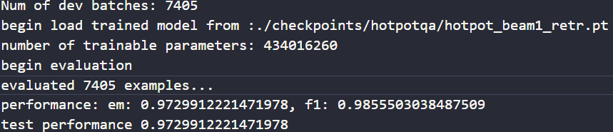

# End-to-End Beam Retrieval for Multi-Hop Question Answering
This is the forked repository for the paper "[End-to-End Beam Retrieval for Multi-Hop Question Answering](https://arxiv.org/abs/2308.08973)".

## Setup

1. Download Data and Model
    - Uses three original datasets [MuSiQue-Ans](https://github.com/StonyBrookNLP/musique/), [HotpotQA](https://hotpotqa.github.io/) and [2WikiMultihopQA](https://github.com/Alab-NII/2wikimultihop) for the main 
    experiments and three paritial datasets sampled by [IRCoT](https://github.com/StonyBrookNLP/ircot).

    - Uses [DeBERTa](https://huggingface.co/microsoft/deberta-v3-base) as the backbone model.

2. Beam Retrieval
    The code for Beam Retrieval is in directory `retrieval`.
    - To train Beam Retrieval, choose the script from `run_train_retr_musique.sh`, `run_train_beam_retr.sh`, 
    `run_train_2wiki.sh`, which aim at MuSiQue-Ans, HotpotQA and 2WikiMultihopQA respectively. Note that you should edit your actual url of data and model in the script. 
    - For inference on HotpotQA, download the [checkpoints](https://github.com/canghongjian/beam_retriever/issues/1#issuecomment-2049002756) and put in `./checkpoints/hotpotqa/` directory. It should look like . Then run the appropriate script in `./inference/` directory depending on whether you need beam1 or beam2. Note that you should edit your actual url of data and model in the script. The result will be saved in `./output/` directory. See [./retrieval/config.py](./retrieval/config.py) for more details on the command args.
    - For open domain retrieval setting, use the data produced by [MDR](https://github.com/facebookresearch/multihop_dense_retrieval/tree/main), and format them in directory `fullwiki`, then train Beam Retrieval using script `run_train_fullwiki_reranker`. 

3. Downstream Reader
    - The code for the supervised downstream reader is in directory `qa`, while the code for LLMs is `llm_exp_long.py`.
    - For training the supervised downstream reader, run `run_train_reader.sh` script. Note that you should edit your actual url of data and model in the script. No checkpoints are available currently unfortunately. See [./qa/config.py](./qa/config.py) for more details on the command args.
    - For using LLM as reader, run `uv run subsample.py` to sample the data. The subsampled results will be in `./processed_data/hotpotqa/`. Note that you should edit the subsampling size and path url in the script. Then run `uv run llm_exp_long.py` to get the results. Note that you should have your environment variables available. The result will be saved in `./llm_reader/` directory. Edit the scripts to your needs.

## Results
All the results of retrieval and downstream reader are in directory `results`.

You can also obtain the scores through running `test_model_tmp.py` after training.

- Retrieval Results on HotpotQA:
    | Beam Type | Results Image |
    |-----------|---------|
    | **Beam1** |  |
    | **Beam2** |  |

## Citation
```bibtex
@inproceedings{
zhang2024endtoend,
title={End-to-End Beam Retrieval for Multi-Hop Question Answering},
author={Jiahao Zhang and Haiyang Zhang and Dongmei Zhang and Yong Liu and Shen Huang},
booktitle={2024 Annual Conference of the North American Chapter of the Association for Computational Linguistics},
year={2024},
url={https://arxiv.org/abs/2308.08973}
}
```
